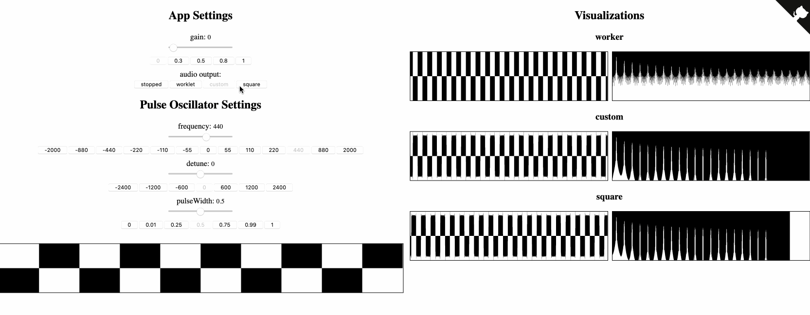
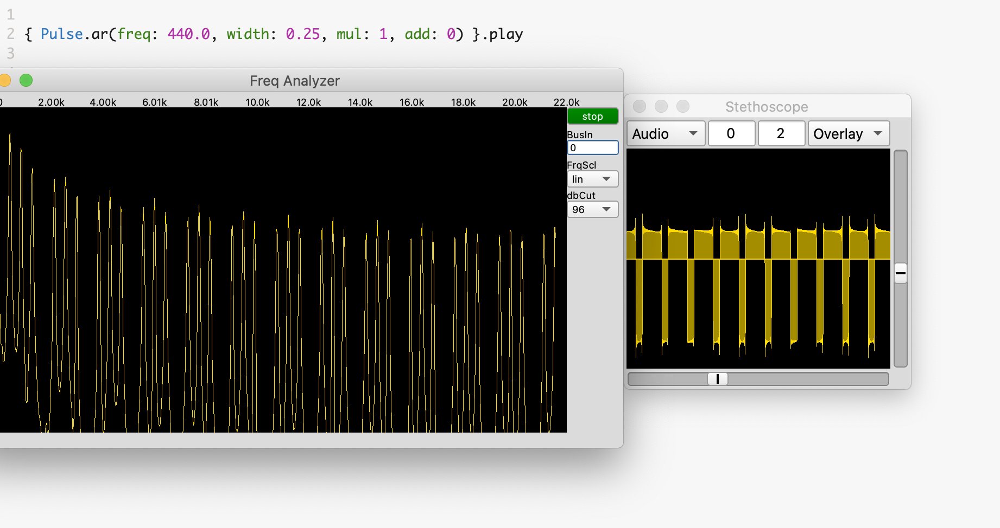
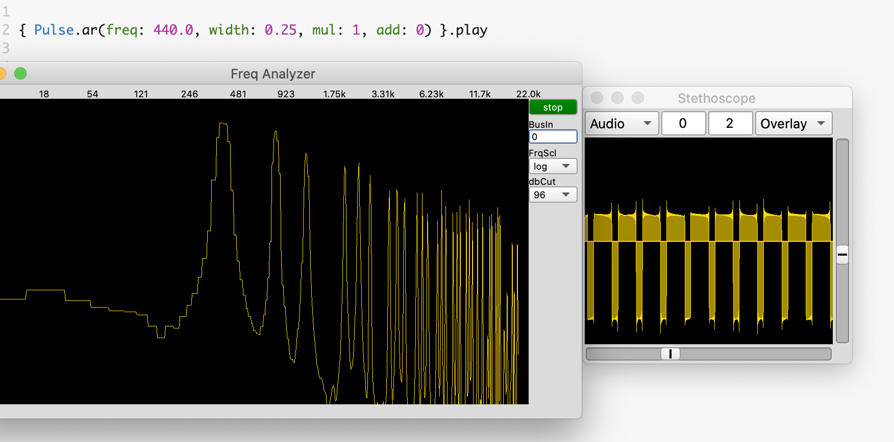

# Pulse Oscillator

A prototype worklet from the github issue here:  
https://github.com/WebAudio/web-audio-api-v2/issues/7

The demo page is here:  
https://projects.skratchdot.com/web-audio-api-v2-issue-7

Worklet source code is here:  
https://github.com/skratchdot/web-audio-api-v2-issue-7/blob/master/public/pulse-oscillator.js

This project was bootstrapped with:  
[Create React App](https://github.com/facebook/create-react-app).



## Running locally

```
git clone git@github.com:skratchdot/web-audio-api-v2-issue-7.git
npm install
npm start
```

## Notes

- Since create-react-app does not have a "loader" for `audioWorklet.addModule()`, I had to put
the worklet code in the public folder here: `public/pulse-oscillator.js`.

- This demo app creates 3 different oscillators:

### 1. square
- available in v1
- cannot set pulseWidth
- cannot automate/modulate pulseWidth
- example:
```
const osc = new OscillatorNode(context, { type: 'square' });
```

### 2. custom
- available in v1
- can set pulseWidth using `setPeriodicWave()` (which cannot be automated/modulated smoothly)
- cannot automate/modulate pulseWidth
- example:
```
const osc = new OscillatorNode(context, { type: 'square' });
osc.setPeriodicWave(wave); // we generate real/imag with a pulseWidth
```

### 3. worklet
- not available in v1. potentially available in v2
- can set pulseWidth
- can automate/modulate pulseWidth
- example:
```
cosnt osc = new AudioWorkletNode(context, 'pulse-oscillator');
```

#### SuperCollider examples

```
{ Pulse.ar(freq: 440.0, width: 0.25, mul: 1, add: 0) }.play
```

##### FFT frqScl=lin


##### FFT frqScl=log


#### Links

- https://ccrma.stanford.edu/~juhan/vas.html
- https://ccrma.stanford.edu/~stilti/papers/blit.pdf
- https://scp.web.elte.hu/papers/synthesis1.pdf
- https://www.cs.cmu.edu/~eli/papers/icmc01-hardsync.pdf
- https://www.desmos.com/calculator/a1jnxwffof
- https://www.experimentalscene.com/articles/minbleps.php
- https://www.music.mcgill.ca/~gary/307/week5/bandlimited.html#SECTION00027000000000000000
- https://www.musicdsp.org/en/latest/Synthesis/112-waveform-generator-using-minbleps.html

